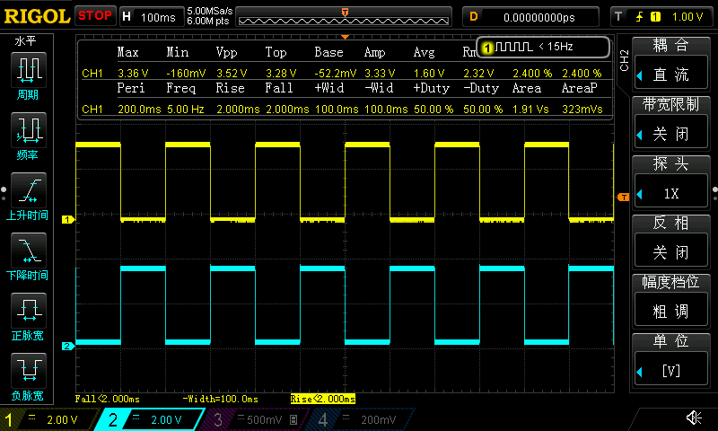

## 简单粗暴的GPIO电平翻转测试

- 测试对象：GPIO0-->10，GPIO18-->21，即开发板15个引出到2.54杜邦接口的GPIO
- 例程：5Hz方波，奇数与偶数GPIO电平互为相反，因为模组的GPIO是奇偶奇偶排列的，所以可以检查焊接问题，虚焊&连锡

## demo

|  |  |
| -------------------------------- | ---------------------- |

