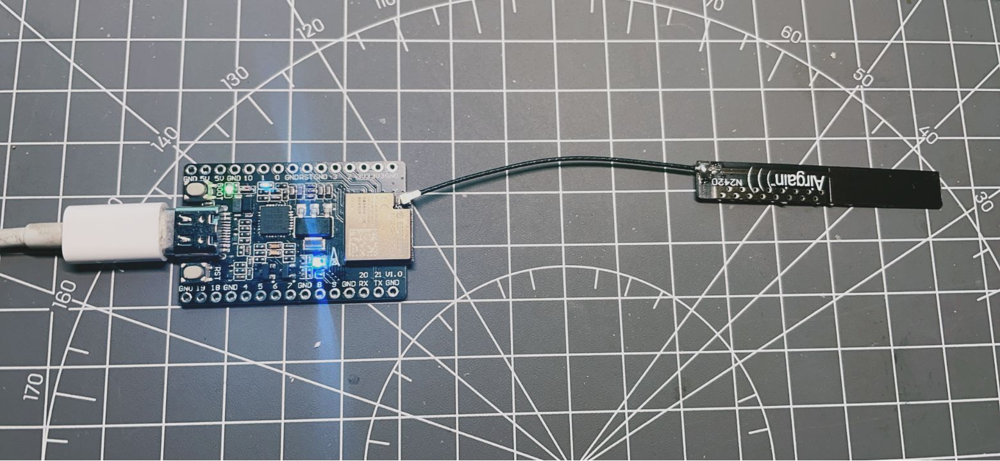

## Wifi信号强度测试

- 测试：天线是否抽风



### Boot信息

```
ESP-ROM:esp32c3-api1-20210207
Build:Feb  7 2021
rst:0x1 (POWERON),boot:0xc (SPI_FAST_FLASH_BOOT)
SPIWP:0xee
mode:DIO, clock div:1
load:0x3fcd6100,len:0x420
load:0x403ce000,len:0x90c
load:0x403d0000,len:0x236c
SHA-256 comparison failed:
Calculated: ccb0d00bac7e84e1d90a12e4f75f4ab6c5f7e71bb209afd5819c4c9557a6db71
Expected: c9cf160580940ec7801c73b16423824e72ad12055c732e83ce66332240af42a7
Attempting to boot anyway...
entry 0x403ce000
Setup done
```

### 未安装天线前

```
scan start
scan done
2 networks found
1: PDCN (-59)*
2: PDCN (-91)*

scan start
scan done
2 networks found
1: PDCN (-67)*
2: PDCN (-90)*

scan start
scan done
2 networks found
1: PDCN (-58)*
2: PDCN (-87)*

scan start
scan done
1 networks found
1: PDCN (-63)*

scan start
scan done
2 networks found
1: PDCN (-58)*
2: PDCN (-92)*

```

### 安装4dBi 天线

####   距离路由器天线60cm

```
scan start
scan done
5 networks found
1: PDCN (-7)*
2: PDCN (-38)*
3: ROOM (-72)*
4: @PHICOMM_54 (-75)*
5: suibianwo (-80)*

scan start
scan done
4 networks found
1: PDCN (-12)*
2: PDCN (-38)*
3: @PHICOMM_54 (-73)*
4: ROOM (-73)*
```

#### 距离路由器天线5cm

```

scan start
scan done
7 networks found
1: PDCN (-26)*
2: PDCN (-55)*
3: D5-4-2 (-75)*
4: TP-LINK_C341 (-86)*
5: zhang (-87)*
6: Wireless Router (-89) 
7: suibianwo (-89)*

scan start
scan done
8 networks found
1: PDCN (-30)*
2: PDCN (-56)*
3: D5-4-2 (-87)*
4: @PHICOMM_54 (-88)*
5: D-6-1 (-88)*
6: suibianwo (-89)*
7: lyf (-89)*
8: 360WiFi-2FF6B6 (-90)*

```

