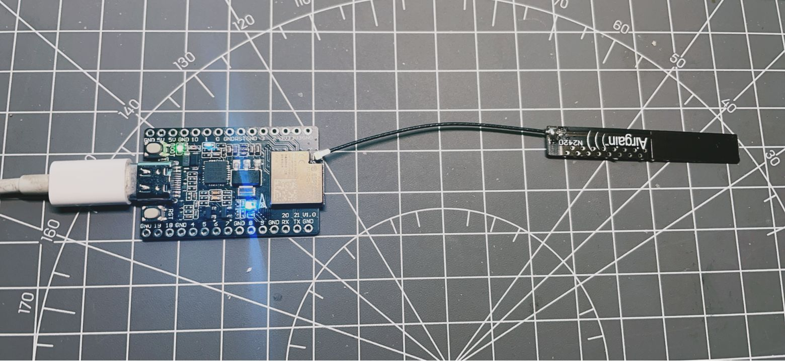

## ESP32-C3-DevKitM-1

> 基于ESP32-C3的开发板，[ESP32-C3-DEVKITM-1](https://docs.espressif.com/projects/esp-idf/zh_CN/latest/esp32c3/hw-reference/esp32c3/user-guide-devkitm-1.html)的重制版，保持十分考究的布局，提供AD原始工程、Gerber、BOM

## 工艺

- 板厚：1.0~1.6mm 均可
- 层数：2层
- 过孔：0.3/0.5mm
- 最小线宽线隙：5mil

## PCB布局

| 使用ESP32-C3 MINI-1模组                                | 使用ESP32-C3 MINI-1U模组                                 |
| ------------------------------------------------------ | -------------------------------------------------------- |
| .png) | .png) |
| .png) | .png) |
| .png) | .png) |

## Type-C正反插

- 正插：使用CP2102的串口
- 反插：使用ESP32-C3FN4或ESP32-C3FH4片内集成的USB串口，可以不焊接CP2102相关的电路使用ESP32-C3自带的USB串口桥烧录或者调试

## 碎碎念

最近的准备用STM32测试[esp-hosted](https://github.com/espressif/esp-hosted)，ESP32-C3拥有[ESP-Hosted-FG]() SPI模式最高的吞吐量(TX/RX 17Mbps)，[ESP32-C3 MINI-1U]()模组又是这几款ESP32提供的模组中尺寸最小的，遂选型之，由于直接使用模组，那么就不用设计模组内的电路部分了，直接找乐鑫官网[ESP32-C3-DEVKITM-1](https://docs.espressif.com/projects/esp-idf/zh_CN/latest/esp32c3/hw-reference/esp32c3/user-guide-devkitm-1.html)开发板（都2202年了还是Micro-USB接口？）提供的原理图和PDF格式的PCB布局做参考，本以为[ESP32-C3-DEVKITM-1](https://docs.espressif.com/projects/esp-idf/zh_CN/latest/esp32c3/hw-reference/esp32c3/user-guide-devkitm-1.html)这块两层板挺好搞定，然而细看背面布局发现画板子的工程师追求连续的GND（UART总线或者USB差分对与其他信号线之间必有GND），给改Type-C增加了不少麻烦

## 照片&亮机测试

Example文件夹内有最基本的wifi、GPIO、串口、RGB灯测试

## 烧录程序

乐鑫工具：[Flash Download Tools](https://www.espressif.com/en/support/download/other-tools)

Arduino环境：简单些，一键选择esp32-c3开发板，一键就行

ESP-IDF：待补充

## 参考资料

[ESP32-C3-DevKitM-1：快速入门](https://docs.espressif.com/projects/esp-idf/zh_CN/latest/esp32c3/hw-reference/esp32c3/user-guide-devkitm-1.html) 